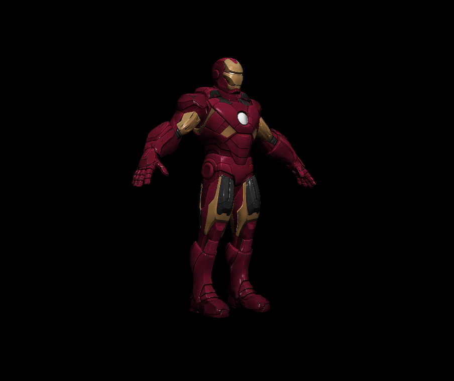

A software renderer

### Controls ###
<table>
    <tr>
        <td><code>N</code></td>
        <td>toggle normal mapping</td>
    </tr>
    <tr>
        <td><code>D</code></td>
        <td>toggle diffuse mapping</td>
    </tr>
    <tr>
        <td><code>S</code></td>
        <td>toggle specular mapping</td>
    </tr>
    <tr>
        <td><code>F</code></td>
        <td>toggle smooth filter</td>
    </tr>
    <tr>
        <td><code>-</code> and <code>-</code></td>
        <td>change pixel size</td>
    </tr>
</table>

